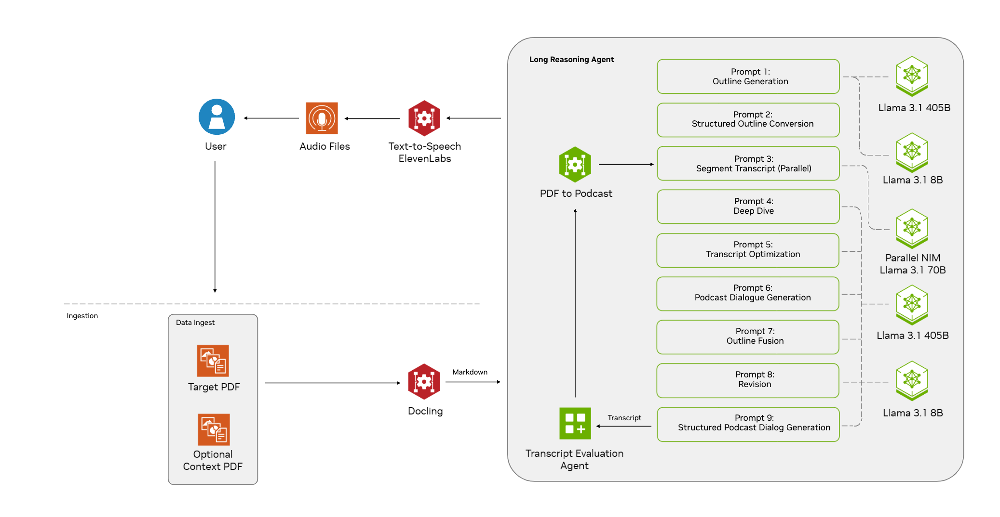

<h2>NVIDIA AI Blueprint: PDF to Podcast</h2>

## Overview

This NVIDIA AI blueprint shows developers how to build an application that transforms PDFs into engaging audio content. Built on NVIDIA NIM, this blueprint is flexible, and can run securely on a private network, delivering actionable insight without sharing sensitive data. 

This blueprint has been modified to run completely locally. There are some leftover artifacts from the Elevelabs TTS pipeline that can be restored by renaming the .bak files. There's NO REQUIREMENT for an Elevenlabs API key. 

Set the Docker Compose profile to local before starting.

This requires, currently, ONE NVIDIA GPU. Tested on 48GB workstation card.
FOR DEMONSTRATION. It is NOT a fully debugged project for UX. This was built to run the full pipeline locally.


To enable single GPU mode, edit the docker-compose.yaml in AIWB :
```
services:
  local-nim:
    image: nvcr.io/nim/meta/llama-3.1-8b-instruct:1.3.3
    runtime: nvidia
    deploy:
      resources:
        reservations:
          devices:
            - driver: nvidia
              device_ids: ["0"] <-------- change to this on local-nim and tts services
              capabilities: [gpu]
```
              


The blueprint accepts a Target PDF and optionally multiple Context PDFs. The Target PDF will be the main source of information for the generated transcript while Context PDFs will be used as additional reference for the agent to use. The user can also optionally specify a guide prompt that will give a focus for the agent generated transcript (i.e. “Focus on the key drivers for NVIDIA’s Q3 earnings report”).

For more information about the PDF, Agent and TTS service flows, please refer to the mermaid [diagram](docs/README.md)

| :exclamation: Important |
| :-----------------------|
| Users running this blueprint with [NVIDIA AI Workbench](https://www.nvidia.com/en-us/deep-learning-ai/solutions/data-science/workbench/) should skip to the quickstart section [here](https://github.com/NVIDIA-AI-Blueprints/pdf-to-podcast/tree/main/workbench#quickstart)! |

## Software Components
- NVIDIA NIM microservices
   - Response generation (Inference)
      - [NIM for meta/llama-3.1-8b-instruct](https://build.nvidia.com/meta/llama-3_1-8b-instruct)
      - [NIM for meta/llama-3.1-70b-instruct](https://build.nvidia.com/meta/llama-3_1-70b-instruct)
      - [NIM for meta/llama-3.1-405B-instruct](https://build.nvidia.com/meta/llama-3_1-405b-instruct)
- Document ingest and extraction - [Docling](https://github.com/DS4SD/docling)
- Text-to-speech - [ElevenLabs](https://elevenlabs.io/)
- Redis - [Redis](https://redis.io/)
- Storage - [MinIO](https://minio.io/)

> **Note:** Since NVIDIA blueprints are adaptable to your specific business use case and/or infrastructure, the above software components are configurable. For example, to decrease the amount of GPU memory required, you can leverage a smaller Llama 3.1-8B NIM and disable GPU usage for Docling in docker-compose.yaml.

Docker Compose scripts are provided which spin up the microservices on a single node.  The Blueprint contains sample use-case PDFs but Developers can build upon this blueprint, by using their own PDFs based upon their specific use case.

## Hardware Requirements
Below are the hardware requirements, these are dependent on how you choose to deploy the blueprint. There are 2 ways to deploy this blueprint:

1. Default - Use NVIDIA API catalog NIM endpoints
   - Can run on any non-gpu accelerated machine/VM
      - 8 CPU cores
      - 64 GB RAM
      - 100GB disk space
      - A public IP address is also required

2. Locally host NVIDIA NIM
   - [Meta Llama 3.1 8B Instruct Support Matrix](https://docs.nvidia.com/nim/large-language-models/latest/support-matrix.html#llama-3-1-8b-instruct)
   - [Meta Llama 3.1 70B Instruct Support Matrix](https://docs.nvidia.com/nim/large-language-models/latest/support-matrix.html#llama-3-1-70b-instruct)
   - [Meta Llama 3.1 405B Instruct Support Matrix](https://docs.nvidia.com/nim/large-language-models/latest/support-matrix.html#llama-3-1-405b-instruct)

> **Note:** To run the blueprint at scale and for faster preprocessing of PDFs, it is recommended to use GPU for running the PDF ingest/extraction pipeline.

## Prerequisites
- NVIDIA AI Enterprise developer licence required to local host NVIDIA NIM.
- API catalog keys:
   - NVIDIA [API catalog](https://build.nvidia.com/) or [NGC](https://org.ngc.nvidia.com/setup/personal-keys)
   - [ElevenLabs](https://elevenlabs.io/docs/api-reference/authentication)

## Quick Start Guide
1. **Docker Compose**

System requirements:  Ubuntu 20.04 or 22.04 based machine, with sudo privileges

Install software requirements:
- Install Docker Engine and Docker Compose. Refer to the instructions for [Ubuntu](https://docs.docker.com/engine/install/ubuntu/).
- Ensure the Docker Compose plugin version is 2.29.1 or higher.
- Run docker compose version to confirm.
- Refer to [Install the Compose plugin](https://docs.docker.com/compose/install/linux/) in the Docker documentation for more information.
- To configure Docker for GPU-accelerated containers, install the [NVIDIA Container Toolkit](https://docs.nvidia.com/datacenter/cloud-native/container-toolkit/latest/install-guide.html).
- Install git

2. **Obtain API keys:**

NVIDIA Inference Microservices (NIM)
- There are two possible methods to generate an API key for NIM:
   - Sign in to the [NVIDIA Build](https://build.nvidia.com/explore/discover?signin=true) portal with your email.
      - Click on any [model](https://build.nvidia.com/meta/llama-3_1-70b-instruct), then click "Get API Key", and finally click "Generate Key".
   - Sign in to the [NVIDIA NGC](https://ngc.nvidia.com/) portal with your email.
      - Select your organization from the dropdown menu after logging in. You must select an organization which has NVIDIA AI Enterprise (NVAIE) enabled.
      - Click on your account in the top right, select "Setup" from the dropdown.
      - Click the "Generate Personal Key" option and then the "+ Generate Personal Key" button to create your API key.
         - This will be used in the NVIDIA_API_KEY environment variable.
      - Click the "Generate API Key" option and then the "+ Generate API Key" button to create the API key.

IMPORTANT:  This will be used in the NVIDIA_API_KEY environment variable below.

[ElevenLabs](https://elevenlabs.io/docs/api-reference/authentication)

3. **Clone the repo**

   ```bash
   git clone https://github.com/NVIDIA-AI-Blueprints/pdf-to-podcast
   ```

4. **Set environment variables**

   ```bash
   #Create env file with required variables in /home/<username>/.local/bin/env  
   echo "ELEVENLABS_API_KEY=your_key" >> .env
   echo "NVIDIA_API_KEY=your_key" >> .env
   echo "MAX_CONCURRENT_REQUESTS=1" >> .env
   ```
> **Note:** the ElevenLabs API key can handle concurrent requests. For local development, set MAX_CONCURRENT_REQUESTS=1 to avoid rate-limiting issues.

5. **Install dependencies**

We use UV to manage Python dependencies.
   ```bash
   make uv
   ```
This will:
- Install UV if not present
- Create virtual environment
- Install project dependencies

If you open up a new terminal window and want to quickly re-use the same environment, you can run make uv again.

6. ** Start the development server**

   ```bash
   make all-services
   ```
> **Note:** The first time you run make all-services, the docling service may take 10-15 minutes to pull and build. Subsequent runs will be much faster.

This command will:
- Verify environment variables are set
- Create necessary directories
- Start all services using Docker Compose in --build mode.

> **Note:** Set DETACH=1 to run the services in detached mode to continue using your terminal while the services are running.

7. View Swagger API documentation

To view the Swagger UI for the API, you can view them locally at `localhost:8002/docs`. If running this on a VM, you will need to port forward 8002 locally or expose the port on your VM. 

8. Generate the Podcast

   ```bash
   source .venv/bin/activate
   python tests/test.py --target <pdf1.pdf> --context <pdf2.pdf>
   ```
By default, this command will generate a 2-person podcast. To generate a 1-person podcast, add the --monologue flag. 
IMPORTANT:  By default `test.py` expects pdfs to be in the `samples` directory.

For debugging an error that occurs in the test, view the docker compose logs.

## Customization
1. **Host the PDF service on a separate machine.**

This blueprint uses docling as the default PDF extraction service.

To run the PDF extraction service on a separate machine, add the following to your .env file:

   ```bash
   echo "MODEL_API_URL=<pdf-model-service-url" >> .env
   ```
The make `model-dev` target will let you spin up only the docling service.

2. **Use Self-hosted NIM**

By default this blueprint uses an ensemble of 3 LLMs to generate podcasts. The example uses the Llama 3.1-8B, Llama 3.1-70B, & Llama 3.1-405B NIMs for balanced performance and accuracy. To use a different model, update the models.json file with the desired model. The default models.json calls an NVIDIA-hosted API Catalog endpoints. This is the default configuration and is recommended for most users getting started with the blueprint but once you want to adapt the blueprint, locally hosted NIM endpoints are required.

3. **Change the Default Models and GPU Assignments**

It is easy to swap out different pieces of the stack to optimize GPU usage for available hardware. For example, minimize GPU usage by swapping in the smaller Llama 3.1-8B NIM and disabling GPU usage for docling in docker-compose.yaml.

4. **Enable Tracing**

We expose a Jaeger instance at http://localhost:16686/ for tracing. This is useful for debugging and monitoring the system.

## Contributing

1. **Fork the repository**
2. **Create a feature branch**
3. **Make your changes**
4. **Run tests:** python tests/test.py <pdf1> <pdf2>
5. **Run linting:** make ruff
6. **Submit a pull request**

## Code Quality

The project uses ruff for linting and formatting. You must run make ruff before your PR can be merged:

   ```bash
   make ruff  # Runs both lint and format
   ```

## CI/CD

We use GitHub Actions for CI/CD. We run the following actions:

- `ruff`: Runs linting and formatting
- `pr-test`: Runs an end-to-end podcast test on the PR
- `build-and-push`: Builds and pushes a new container image to the remote repo. This is used to update production deployments

## Security Considerations

**Important** : This setup uses HTTP and is not intended for production deployments. For production deployments, consider implementing the following security measures:

- Add SSL/TLS encryption by either:
   - Configuring uvicorn with SSL certificates
   - Setting up a reverse proxy (like Nginx) to handle SSL termination
   - Implement proper certificate management
   - Configure appropriate security headers
- Follow other web security best practices
