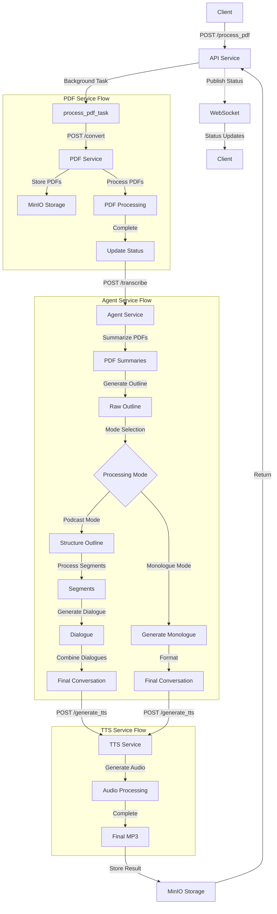

```mermaid
graph TD
    A[Client] -->|POST /process_pdf| B[API Service]
    B -->|Background Task| C[process_pdf_task]
    
    subgraph "PDF Service Flow"
        C -->|POST /convert| D[PDF Service]
        D -->|Store PDFs| E[MinIO Storage]
        D -->|Process PDFs| F[PDF Processing]
        F -->|Complete| G[Update Status]
    end
    
    subgraph "Agent Service Flow"
        G -->|POST /transcribe| H[Agent Service]
        H -->|Summarize PDFs| I[PDF Summaries]
        I -->|Generate Outline| J[Raw Outline]
        
        J -->|Mode Selection| K{Processing Mode}
        
        K -->|Podcast Mode| L[Structure Outline]
        L -->|Process Segments| M[Segments]
        M -->|Generate Dialogue| N[Dialogue]
        N -->|Combine Dialogues| O[Final Conversation]
        
        K -->|Monologue Mode| P[Generate Monologue]
        P -->|Format| Q[Final Conversation]
    end
    
    subgraph "TTS Service Flow"
        O -->|POST /generate_tts| R[TTS Service]
        Q -->|POST /generate_tts| R
        R -->|Generate Audio| S[Audio Processing]
        S -->|Complete| T[Final MP3]
    end
    
    T -->|Store Result| U[MinIO Storage]
    U -->|Return| B
    
    %% WebSocket Status Updates
    V[WebSocket] -->|Status Updates| W[Client]
    B -.->|Publish Status| V
```